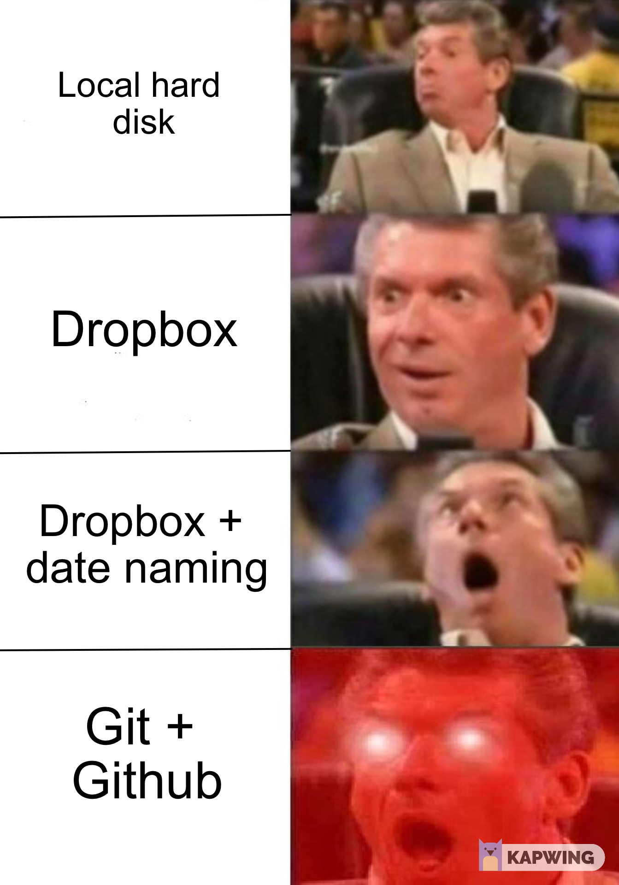
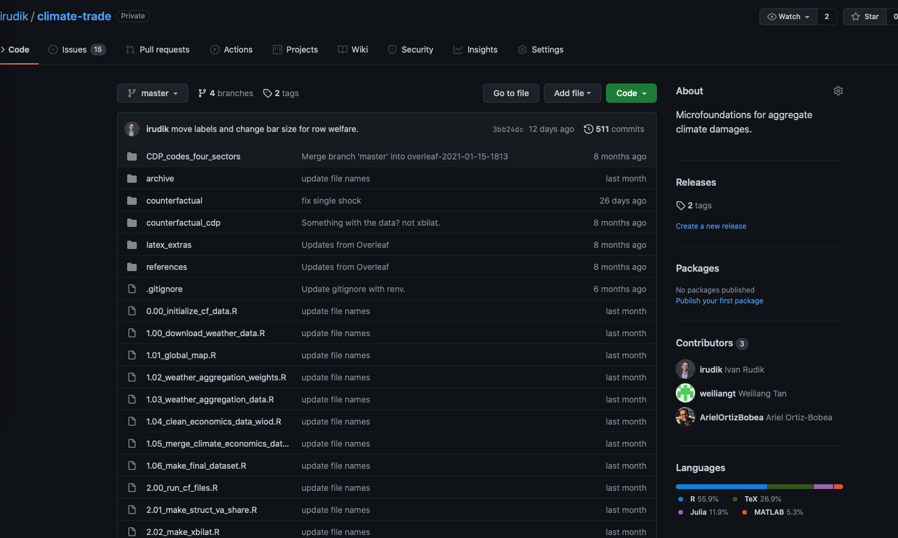
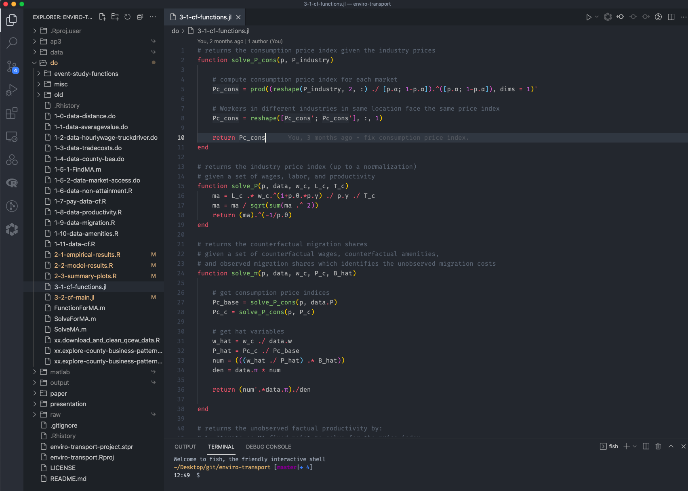
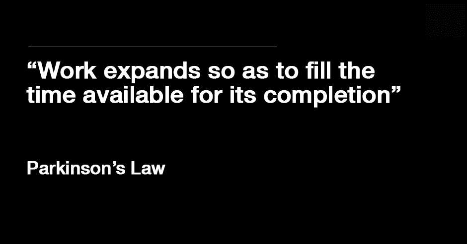
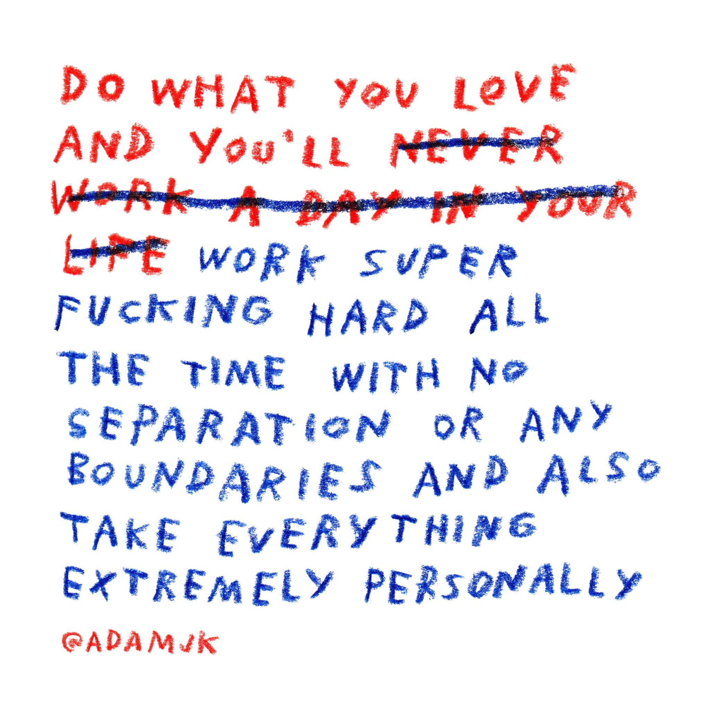

exclude: true
```{r setup}
if (!require("pacman")) install.packages("pacman")
pacman::p_load(
  png, tweetrmd
)
options(htmltools.dir.version = FALSE)
knitr::opts_hooks$set(fig.callout = function(options) {
  if (options$fig.callout) {
    options$echo <- FALSE
  }
knitr::opts_chunk$set(echo = TRUE, fig.align="center")
  options
})
```

```{css, echo=FALSE}
/* custom.css */
.left-code {
  color: #777;
  width: 38%;
  height: 92%;
  float: left;
}
.right-plot {
  width: 60%;
  float: right;
  padding-left: 1%;
}
.plot-callout {
  height: 225px;
  width: 450px;
  bottom: 5%;
  right: 5%;
  position: absolute;
  padding: 0px;
  z-index: 100;
}
.plot-callout img {
  width: 100%;
  border: 4px solid #23373B;
}
```

---

# What is workflow?

--

The design of how you go about doing research

--

The goal is to optimize the combination of things you care about:

- Efficiency
- Total research production
- Enjoyability
- Mental expenditures
- Research quality
- Having the process be easy and foolproof

--

> "You need to protect yourself from previous you." -Alex Hollingsworth

---

# Why does it matter?

Research is a marathon

--

|          Paper          | Initial Work | Submitting |    R&R   | Accepted | Published | Total Time (Years) | Time to Submit (Years) |
|-----------------------|:------------:|:----------:|:--------:|:--------:|:---------:|:----------:|:--------------:|
|   Climate Inertia        |   Feb-2012   |  Jun-2014  | Dec-2015 | Apr-2017 |  Oct-2017 |    5.67    |      2.33      |
|    RPS Theory    |   Feb-2013   |  Jan-2016  | Dec-2017 | Feb-2018 |  Jun-2018 |    5.33    |      2.92      |
|           RPS Empirics           |   Feb-2013   |  Nov-2015  | Jan-2017 | Feb-2018 |  Jan-2019 |    5.92    |      2.75      |
|         Climate Damage Risk         |   Feb-2014   |  Jan-2016  | Apr-2017 | Aug-2019 |  May-2020 |    6.25    |      1.92      |
|         Gas Flaring         |   Dec-2015   |  Dec-2017  | Dec-2019 | Apr-2020 |  Jul-2020 |    4.59    |        2       |
|          Parks Air Pollution          |   Jan-2016   |  Jan-2018  | Apr-2018 | Jun-2018 |  Jul-2018 |     2.5    |        2       |
|        Lead Mortality        |   Jan-2018   |  Jul-2019  | Dec-2019 | Jun-2020 |  Aug-2021 |    3.58    |       1.5      |
|     Lead Test Scores    |   Jan-2018   |  Dec-2020  |          |          |           |            |      2.92      |
|   Climate Adaptation        |   Sep-2018   |            |          |          |           |            |                |
|          Birds and Pollution          |   Jan-2019   |  Jun-2020  | Jul-2020 | Oct-2020 |  Dec-2020 |    1.92    |      1.42      |
|   Valuing Forecasts       |   Jan-2019   |            |          |          |           |            |                |
| Growth and Biodiversity |   Apr-2020   |            |          |          |           |            |                |
|  Geography of Regulation|   Apr-2020   |            |          |          |           |            |                |
|  Social Cost of Carbon  |   Sep-2020   |            |          |          |           |            |                |
|       Climate Networks       |   Jun-2021   |            |          |          |           |            |                |

---

# Why does it matter?

Projects take .hi-blue[years]

--

This means you're juggling 2-10 projects at a time depending on your style

--

Previous slide shows I have .hi[seven] projects going right now (probably 2 are getting attention in any given week)
  - 3 working papers
  - 2 late stage projects
  - 2 early stage projects

--

Good workflow is a way to manage this work and get stuff done in a sustainable and efficient way

---

# Caveats and qualifications

What I'm going to tell you about is what .hi[I] think is important and how .hi[I] do stuff

--

Others may disagree or would do things in a different way

--

The key thing is lots of people have thought about this before you so you don't need to reinvent the wheel here: just steal other people's idea and methods that sound good and give them a shot

--

Good sources: EconTwitter, Hidden Curriculum Podcast, Shapiro and Gentzkow notes, Grant McDermott, Alex Hollingsworth, Patrick Baylis, Stack Exchange

---

# (Some) key components

- Programming
- Version control
- Code/data management and project organization
- Time management

---

class: inverse, center, middle
name: programming

# Programming

<html><div style='float:left'></div><hr color='#EB811B' size=1px width=796px></html>

---

# Programming is srs business

.pull-left[
```{r r1, echo = FALSE, fig.pos="c"}
tweet_screenshot(
  "https://twitter.com/AndrewBarnas/status/1430553416065961984",
  scale = .8
  )
```
]

.pull-right[
```{r r2, echo = FALSE, fig.pos="c"}
tweet_screenshot(
  "https://twitter.com/jodiecongirl/status/1333471280042012676?s=20",
  scale = 1
  )
```
]

---

# Programming is srs business

Choice of programming language doesn't matter, but it kind of does

--

IMO it just a big fixed cost component of research and workflow

--

What you settle on should depend on at least the following things:

--

- Your previous programming experience
--

- How much you like programming / learning new languages
--

- The field you work in
--

- How much you care about co-authoring
--

- How much you're into open science and reproducibility

---

# Programming is srs business

Conventional choices for economists: Stata and MATLAB

--

Why?

--

Both are super easy to learn, and have built-in integrated development environments (IDEs)

--

Both are proprietary software so typically they work well, don't have to worry a whole lot about backward compatability etc

--

Stata has a .hi[very] rich set of packages for economists

--

MATLAB's package ecosystem is bad but it has first-mover advantage

---

# Programming is srs business

What are the most common alternatives?

--

R and Julia are seeing large relative gains (small absolute gains) in usage by economists

--

Why?

--

Both are .hi[way] better at stuff that is increasingly important in economics

--

Handling large datasets (feols vs reghdfe), geospatial analysis (sf vs ArcGIS), large-scale quantitative models (CDP vs RLTO)

--

Both are open source: free, but generally things aren't quite as polished


---

# Programming is srs business

Major tradeoffs:

R/Julia have a smaller userbase in econ, by a lot
- Every AEJ: App paper last year had Stata code
- Rudik (2020) is the second(?) AEA journal paper using Julia

But the R/Julia share of economists working on cutting-edge stuff with big data, ML, quant models is larger (e.g. Grant McDermott, Jonathan Dingel, Milena Almagro, Alex Hollingsworth, Ariel Ortiz-Bobea, me)


These network externalities matter

---

# Programming is srs business

Trade off of your actual time vs computer time

Some large-scale problems are unsolvable with Stata/MATLAB, you might need to learn another language anyway

---

class: inverse, center, middle
name: versioning

# Version control

<html><div style='float:left'></div><hr color='#EB811B' size=1px width=796px></html>


---

# Version control

Version control is how you manage and track changes to your files

--

Research is a highly non-linear process: you inevitably will need to go back to previous versions of your project to undo changes, fix new errors you can't figure out, etc 

--

There's .hi-blue[many] different method to versioning, all have different levels of fixed and variable costs you need to incur to use them


---

# Choose your level of control

<center>
```{r, out.width = "35%", fig.pos="c", echo = FALSE}

```
</center>

---

# Versioning level 1

One way to do version control is to just keep different versions of files on your local hard drive: `file-03-01-2021`, `file-03-02-2021`, `file-final_FINAL2`, `file-myname`, `file-myname-yourname`

--

You are technically doing version control, but it's messy, decentralized, and not really systematic

--

Don't do this

--

Seriously, don't

---

# Versioning level 2

A better way to do is is through a cloud storage provider like Dropbox, Box, etc

--

This centralizes your file locations across all co-authors and machines, provides a nice backup in case of a local hard drive failure

--

If you pay for the fancier versions you can also rewind to previous versions up to X days agos

---

# Versioning level 3

A third way to do this is to combine 1 and 2: use a cloud provider but then use some sort of file naming system to keep track of different versions

<center>
```{r, out.width = "45%", fig.pos="c", echo = FALSE}
knitr::include_graphics("figures/bad_version_control.png")
```
</center>

The problem is then you have lots of files, little understanding of changes made between versions


---

# Versioning level 4

The ideal way to handle version control is with proper version control software along with cloud-based services

--

This is typically .hi[Git] using along with .hi-blue[GitHub]

--

Git keeps track of changes of your files and stores these changes in a history along with messages, tags, author identifiers, etc

--

This makes it very easy to find who made changes and when and to see exactly what changes were made

---

# Versioning level 4: Git

Quick example of one of the programs (SourceTree) you can use to implement Git/GitHub workflow:

<center>
```{r, out.width = "100%", fig.pos="c", echo = FALSE}
knitr::include_graphics("figures/git_history.png")
```
</center>

---

# Versioning level 4: Git

Quick example of a GitHub repo:

<center>
```{r, out.width = "100%", fig.pos="c", echo = FALSE}

```
</center>

---

class: inverse, center, middle
name: management

# Code/data management and project organization

<html><div style='float:left'></div><hr color='#EB811B' size=1px width=796px></html>

---

# Data/code management

How does data/code organization improve workflow?

--

Less stuff you need to keep in your brain

--

If everything is the same, then working with your projects becomes largely automatic, no trying to remember where certain types of data are located, how you organize your coding scripts in run-order, etc

--

Makes life easier to use best practices like relative file paths, `here::here`, etc

---

# One way to organize data and code

- Parent folder
   - Code folder
     - Data cleaning code
     - Analysis code
   - Data folder
      - Raw data
      - Clean data
   - Output folder
   - LaTeX folder

---

# Code script organization

A project will likely have multiple files for data cleaning/analysis

--

This largely makes sense: having more modular / function-oriented code is generally better

--

When working with other people (or your future self), it's smart to order your files:

- 01.first-file-to-run
- 02.second-file-to-run
- ...
- 000.project-functions
- 000.RUN-ALL-SCRIPTS.sh

---

# Centralize and optimize your environments

One recommendation I have is to centralize and optimize your coding environment

--

You will often have to use multiple languages

--

Built-in IDEs for many languages are mediocre or just straight up bad (hi Stata)

--

Having a single coding environment that is easy to modify and adapt will make you much more efficient at your job

--

There's a lot of options (Atom, emacs, Vim, Sublime Text) but I'll tell you about .hi-blue[Visual Studio Code]

---

# Centralize and optimize your environments: VSCode

.hi-blue[Visual Studio Code (VSCode)] is probably the most widely used development environment

<center>
  ```{r, out.width = "100%", fig.pos="c", echo = FALSE}
  
  ```
</center>

---

# Centralize and optimize your environments: VSCode

How does using VSCode (or Atom/Sublime/etc) improve workflow?

1. The environment is the same no matter whether I'm writing in R/Stata/Julia/MATLAB/Python/LaTeX,whatever
--

2. VSCode is .hi[highly] customiziable, has useful linting, syntax highlighting, and my fav: bracket matching
--

3. VSCode has remote development capabilities so you can connect to BioHPC, RedCloud, AWS, etc
--

4. Fully integrated with Git
--

5. Lots of useful and customizable hot keys for mass editing

---

# Tasks and communication

Organizing tasks and project communication is important for actually getting things done

--

There are .hi[many] ways to do this

--

Here's a few suggestions:

1. [GitHub Issues](https://github.com/irudik/climate-trade/issues)
2. [Slack](https://slack.com)
3. Other task management providers: [Asana](https://asana.com), [Wrike](https://wrike.com), etc (possibly with Slack)

---

# Tasks and communication

If you're a Git user I recommend using [GitHub Issues](https://github.com/irudik/climate-trade/issues):

1. Everything's on GitHub
2. Commits/pull requests etc can be referenced in task-specific issues so changes are easy to find
3. GitHub has a Projects feature that is similar to Asana/Wrike

---

# Writing

If you've got co-authors I recommend [Overleaf](https://overleaf.com)

--

It's cloud-based, integrates with Dropbox and GitHub, and has a RTF editor for your non-LaTeX co-authors

--

Solo projects: probably use Dropbox or Git+GitHub


---

# Meta-reproducibility

If you're interested in reproducibility of projects you should take Lars Vilhuber's workshop at the beginning of fall

--

Reproducibility is just ensuring that your project always works when you run it on as many types of machines and operating systems as possible

--

When I say meta-reproducibility I mean the ability to quickly reproduce the foundation of a new (reproducible) project without much effort

--

The key idea is that the framework for your code, writing, etc should all be the same and easy to implement

---

# Meta-reproducibility


Spinning up a new project with people should be .hi-blue[easy] (besides the research part)

--

Easy way to set up the initial framework: 

- Create a GitHub template repo
  - https://github.com/cornell-seere/repo-template
- Create a GitHub repo for your Dropbox folder for non-versioned files
  - https://github.com/cornell-seere/dropbox-template

If you do this you can spin up a full, clean project in ~1 minute

---

# Cross-project reproducibility

You're going to use the same functions a lot of the time across projects, e.g. here's my base plotting template:

```
main_theme <- 
  theme_minimal() +
  theme(
    legend.position = "none",
    title = element_text(size = 24),
    axis.text.x = element_text(size = 24), axis.text.y = element_text(size = 24),
    axis.title.x = element_text(size = 24), axis.title.y = element_text(size = 24),
    panel.grid.minor.x = element_blank(), panel.grid.major.y = element_blank(),
    panel.grid.minor.y = element_blank(), panel.grid.major.x = element_blank(),
    panel.background = element_rect(fill = "#ffffff", colour = NA),
    plot.background = element_rect(fill = "#ffffff", colour = NA),
    axis.line = element_line(colour = "black")
  )
```

---

class: inverse, center, middle
name: timemanagement

# Time management and organization

<html><div style='float:left'></div><hr color='#EB811B' size=1px width=796px></html>

---

# Time management

<center>
  ```{r, out.width = "100%", fig.pos="c", echo = FALSE}
  
  ```
</center>


---

# Time management

<center>
  ```{r, out.width = "50%", fig.pos="c", echo = FALSE}
  
  ```
</center>

---

# Time management

There's a lot of fancy books and stuff on this

--

First-order thing that matters (imo): work when you're most productive

--

I schedule no meetings or obligations in the morning because that's when I like to do research

--

Second-order thing for me: I typically have some task in mind that I want to complete in the next 2-3 hours (e.g. get half my presentation slides done, finishing writing the code to aggregate the CPS to state-level, etc)

--

Anyone who tells you they actually do 40+ hours of research a week is lying to you